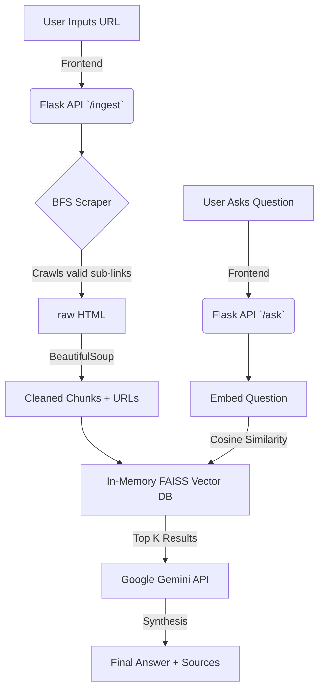

<div align="center">

# ⚡ DocRAG Intelligence
**Next-Generation Documentation Retrieval & Synthesis Engine**

[](https://www.python.org/downloads/release/python-390/)
[](https://flask.palletsprojects.com/)
[](https://ai.google.dev/)
[](https://www.docker.com/)

[**Live Demo (Hugging Face Spaces)**](https://huggingface.co/spaces/Amaanlakdawala/DocRAG) • [**Report Bug**](#) • [**Request Feature**](#)

---

</div>

DocRAG Intelligence is a high-performance **Retrieval-Augmented Generation (RAG)** system designed to seamlessly ingest massive, multi-page online documentation and turn it into a dynamic, query-able knowledge base. Give it a URL, and it maps the documentation subtree, embeds the context, and uses **Google's Gemini 3.1 Flash** to answer highly specific technical questions with precise source attributions.

## ✨ Key Features

*   🕸️ **Intelligent BFS Documentation Crawler:** Maps internal documentation URLs via Breadth-First Search (BFS), strictly adhering to domain boundaries while automatically excluding junk pages.
*   🧠 **In-Memory Vector Search:** Utilizes `FAISS` and `sentence-transformers` locally to compute and map semantic embeddings natively without third-party vector-database costs.
*   🤖 **Gemini 3.1 Flash Integration:** Generates human-readable, technically accurate answers using Google's fastest reasoning model.
*   🔗 **Source Attribution Preservation:** Every chunk of text retrieved retains a strict mathematical mapping to its origin `source_url`. Answers cite the exact documentation page they extracted data from.
*   💎 **Glassmorphic UI/UX:** A stunning, CSS-native, single-page application built on standard vanilla HTML/JS mimicking modern tech aesthetics.

## 🏗️ Architecture



## 🚀 Quick Start

### 1. Prerequisites
Ensure you have Python 3.9+ installed and a valid API key from [Google AI Studio](https://aistudio.google.com/app/apikey).

### 2. Local Installation

```bash
git clone https://github.com/AMAANL/DocRAG.git
cd DocRAG

# Create and activate a virtual environment
python -m venv venv
source venv/bin/activate  # On Windows use: venv\Scripts\activate

# Install dependencies
pip install -r requirements.txt
```

### 3. Environment Configuration

Create a `.env` file at the root directory:
```bash
GEMINI_API_KEY=your_google_gemini_api_key_here
```

### 4. Boot the Server
```bash
python app.py
```
Visit `http://127.0.0.1:5000` in your browser. 

## 🐳 Docker Deployment

DocRAG runs flawlessly in isolated containers and is built to be deployed on Hugging Face Spaces (or any cloud VPS).

```bash
docker build -t doc-rag .
docker run -p 7860:7860 -e GEMINI_API_KEY="your_key" doc-rag
```

## 🛠️ Tech Stack

- **Backend:** Python, Flask
- **Scraping:** BeautifulSoup4, Requests
- **Embeddings:** `sentence-transformers/all-MiniLM-L6-v2`
- **Vector Database:** FAISS
- **Generative AI:** `google-genai`
- **Frontend:** Vanilla HTML5, CSS3, JS

---
<div align="center">
<i>Built for the open-source community to make documentation accessible for everyone.</i>
</div>
